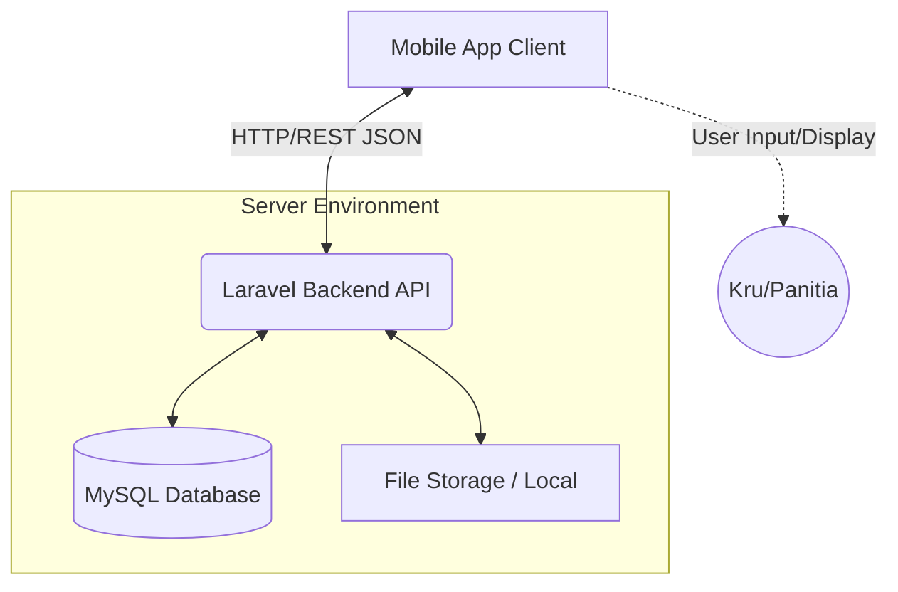

# Arsitektur Sistem KruHub 🏗️

Dokumen ini memberikan gambaran komprehensif mengenai arsitektur sistem **KruHub**, sebuah aplikasi *mobile* manajemen kru dan kolaborasi kepanitiaan dengan dukungan *backend* API.

## Daftar Isi
1. [Topologi Sistem (High-Level Architecture)](#1-topologi-sistem-high-level-architecture)
2. [Stack Teknologi](#2-stack-teknologi)
3. [Komponen Utama](#3-komponen-utama)
4. [Alur Data & State Machine](#4-alur-data--state-machine)
5. [Keamanan Sistem](#5-keamanan-sistem)
6. [Struktur Direktori Repositori](#6-struktur-direktori-repositori)

---

## 1. Topologi Sistem (High-Level Architecture)

KruHub menerapkan pola arsitektur **Client-Server** dengan pemisahan (*decoupling*) yang jelas antara antarmuka pengguna (*Mobile App*) dan logika bisnis sentral (*RESTful API*).



---

## 2. Stack Teknologi

- **Frontend (Mobile App):** [Isi dengan teknologi mobile yang Anda gunakan, misal: Flutter / Java / .NET MAUI]
- **Backend API:** Laravel (PHP)
- **Database:** MySQL
- **Authentication:** Laravel Sanctum (Token-based)
- **Version Control & Collaboration:** Git & GitHub

---

## 3. Komponen Utama

### A. Client-Side (Mobile Application)
Berperan murni sebagai *Presentation Layer*.
- **State Management:** Mengelola state lokal aplikasi dan sesi autentikasi (menyimpan Bearer Token).
- **API Consumption:** Melakukan HTTP Request (GET, POST, PUT, PATCH, DELETE) ke *endpoint* API backend dan merender *response* JSON ke dalam UI.
- **User Interface:** Menampilkan *dashboard* tugas, form unggah dokumen/aset, dan riwayat status *approval*.

### B. Server-Side (Laravel RESTful API)
Berperan sebagai *Business Logic Layer* dan pengendali utama.
- **Routing & Controllers:** Menangani *request* HTTP masuk dan memetakannya ke logika bisnis yang sesuai. API dirancang menggunakan standar REST.
- **Middleware:** Memfilter *request*, memvalidasi token otentikasi, dan mengecek *Role-Based Access Control* (RBAC).
- **Eloquent ORM:** Berinteraksi dengan *database* MySQL untuk manipulasi data tanpa menulis kueri SQL mentah.
- **File Handling:** Memproses berkas yang diunggah (*multipart/form-data*), memvalidasi tipe MIME, dan menyimpannya ke direktori `storage/app/public`.

### C. Data & Storage Layer
- **MySQL Database:** Menyimpan data relasional terstruktur. Sistem ini sangat bergantung pada fitur **Soft Deletes** secara ekstensif pada tabel utama (seperti *tasks*, *assets*, *users*) untuk menjaga *audit trail* dan mencegah kehilangan data historis kepanitiaan.
- **File Storage:** Menyimpan data biner/media (gambar desain poster, proposal dokumen, dll) yang diunggah oleh kru.

---

## 4. Alur Data & State Machine

Sistem ini memiliki siklus hidup aset/tugas (*Workflow State Machine*) yang memvalidasi alur birokrasi kepanitiaan.

**Contoh Skenario: Approval Workflow Desain Publikasi**
1. **Upload (DRAFT):** Kru lapangan mengunggah revisi desain. Aplikasi mengirim request `POST`. API menyimpan *file* dan mencatat *record* di *database* dengan status `DRAFT`.
2. **Review:** Koordinator Divisi menarik data melalui *endpoint* `GET /api/assets/pending` untuk melihat daftar aset yang perlu ditinjau.
3. **Action:** Koordinator memberikan persetujuan dengan menekan tombol "Approve". Aplikasi mengirim `PATCH /api/assets/{id}/approve`.
4. **Approved:** Status di *database* berubah menjadi `APPROVED`. Logika di *controller* secara otomatis mengunci baris data ini sehingga tidak dapat lagi di-edit atau dihapus oleh kru biasa.

---

## 5. Keamanan Sistem

- **Token-Based Authentication:** Menggunakan *Bearer Token* (Laravel Sanctum) untuk setiap *request* yang membutuhkan otorisasi, memastikan *stateless authentication*.
- **Role-Based Access Control (RBAC):** Membedakan hak akses dan *permissions* antara *Super Admin*, *Ketua Pelaksana*, *Koordinator*, dan *Staf/Kru*.
- **Input Validation:** Melakukan validasi *request* secara ketat menggunakan *Laravel Form Request* untuk mencegah SQL Injection, XSS, dan memastikan *file* unggahan sesuai format yang diizinkan.
- **Data Preservation:** Implementasi *Soft Deletes* (kolom `deleted_at`) memastikan penghapusan data via API tidak menghapus baris di *database* secara fisik.

---

## 6. Struktur Direktori Repositori (Backend API)

Sistem *backend* mengikuti struktur hierarki standar Laravel dengan penyesuaian khusus untuk mode API:

```text
kruhub-backend/
├── app/
│   ├── Http/
│   │   ├── Controllers/Api/   # Controller khusus logika API (mereturn JSON response)
│   │   ├── Requests/          # Validasi Input (FormRequest)
│   │   └── Middleware/        # Filter request (RBAC, Sanctum auth)
│   └── Models/                # Model Eloquent dengan trait SoftDeletes
├── database/
│   ├── migrations/            # Skema dan relasi tabel (termasuk foreign keys)
│   └── seeders/               # Data inisial (Roles, Admin default, status dummy)
├── routes/
│   └── api.php                # Registrasi seluruh rute endpoint API
└── storage/
    └── app/public/            # Direktori penyimpanan media/aset yang diunggah pengguna
```
