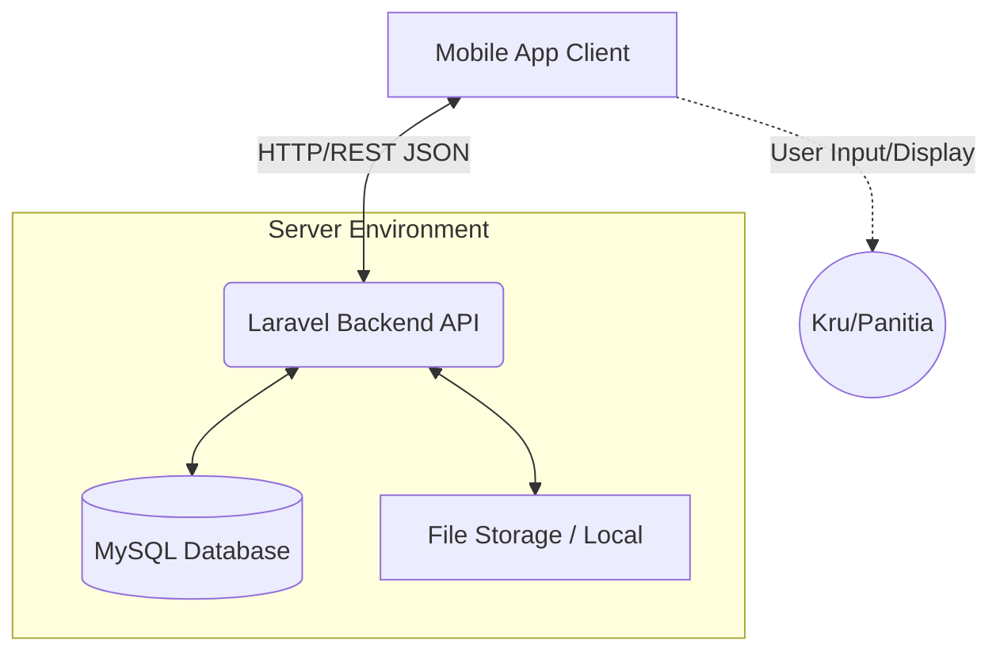

# Arsitektur Sistem KruHub 🏗️

Dokumen ini memberikan gambaran komprehensif mengenai arsitektur sistem **KruHub**, sebuah aplikasi *mobile* manajemen kru dan kolaborasi kepanitiaan dengan dukungan *backend* API.

## Daftar Isi
1. [Topologi Sistem (High-Level Architecture)](#1-topologi-sistem-high-level-architecture)
2. [Stack Teknologi](#2-stack-teknologi)
3. [Komponen Utama](#3-komponen-utama)
4. [Alur Data & State Machine](#4-alur-data--state-machine)
5. [Keamanan Sistem](#5-keamanan-sistem)
6. [Struktur Direktori Repositori](#6-struktur-direktori-repositori)

---

## 1. Topologi Sistem (High-Level Architecture)

KruHub menerapkan pola arsitektur **Client-Server** dengan pemisahan (*decoupling*) yang jelas antara antarmuka pengguna (*Mobile App*) dan logika bisnis sentral (*RESTful API*).

```mermaid
graph TD
    Client[Mobile App Client] <-->|HTTP/REST JSON| API(Laravel Backend API)
    
    subgraph Server Environment
    API <--> DB[(MySQL Database)]
    API <--> Storage[File Storage / Local]
    end
    
    Client -.->|User Input/Display| User((Kru/Panitia))
```

---

## 2. Stack Teknologi

- **Frontend (Mobile App):** Flutter
- **Backend API:** Laravel (PHP)
- **Database:** MySQL
- **Authentication:** Laravel Sanctum (Token-based)
- **Version Control & Collaboration:** Git & GitHub

---

## 3. Komponen Utama

### A. Client-Side (Mobile Application)
Berperan murni sebagai *Presentation Layer*.
- **State Management:** Mengelola state lokal aplikasi dan sesi autentikasi (menyimpan Bearer Token).
- **API Consumption:** Melakukan HTTP Request (GET, POST, PUT, PATCH, DELETE) ke *endpoint* API backend dan merender *response* JSON ke dalam UI.
- **User Interface:** Menampilkan *dashboard* tugas, form unggah dokumen/aset, dan riwayat status *approval*.

### B. Server-Side (Laravel RESTful API)
Berperan sebagai *Business Logic Layer* dan pengendali utama.
- **Routing & Controllers:** Menangani *request* HTTP masuk dan memetakannya ke logika bisnis yang sesuai. API dirancang menggunakan standar REST.
- **Middleware:** Memfilter *request*, memvalidasi token otentikasi, dan mengecek *Role-Based Access Control* (RBAC).
- **Eloquent ORM:** Berinteraksi dengan *database* MySQL untuk manipulasi data tanpa menulis kueri SQL mentah.
- **File Handling:** Memproses berkas yang diunggah (*multipart/form-data*), memvalidasi tipe MIME, dan menyimpannya ke direktori `storage/app/public`.

### C. Data & Storage Layer
- **MySQL Database:** Menyimpan data relasional terstruktur. Sistem ini sangat bergantung pada fitur **Soft Deletes** secara ekstensif pada tabel utama (seperti *tasks*, *assets*, *users*) untuk menjaga *audit trail* dan mencegah kehilangan data historis kepanitiaan.
- **File Storage:** Menyimpan data biner/media (gambar desain poster, proposal dokumen, dll) yang diunggah oleh kru.

---

## 4. Alur Data & State Machine

Sistem ini memiliki siklus hidup aset/tugas (*Workflow State Machine*) yang memvalidasi alur birokrasi kepanitiaan.

**Contoh Skenario: Approval Workflow Desain Publikasi**
1. **Upload (DRAFT):** Kru lapangan mengunggah revisi desain. Aplikasi mengirim request `POST`. API menyimpan *file* dan mencatat *record* di *database* dengan status `DRAFT`.
2. **Review:** Koordinator Divisi menarik data melalui *endpoint* `GET /api/assets/pending` untuk melihat daftar aset yang perlu ditinjau.
3. **Action:** Koordinator memberikan persetujuan dengan menekan tombol "Approve". Aplikasi mengirim `PATCH /api/assets/{id}/approve`.
4. **Approved:** Status di *database* berubah menjadi `APPROVED`. Logika di *controller* secara otomatis mengunci baris data ini sehingga tidak dapat lagi di-edit atau dihapus oleh kru biasa.

---

## 5. Keamanan Sistem

- **Token-Based Authentication:** Menggunakan *Bearer Token* (Laravel Sanctum) untuk setiap *request* yang membutuhkan otorisasi, memastikan *stateless authentication*.
- **Role-Based Access Control (RBAC):** Membedakan hak akses dan *permissions* antara *Super Admin*, *Ketua Pelaksana*, *Koordinator*, dan *Staf/Kru*.
- **Input Validation:** Melakukan validasi *request* secara ketat menggunakan *Laravel Form Request* untuk mencegah SQL Injection, XSS, dan memastikan *file* unggahan sesuai format yang diizinkan.
- **Data Preservation:** Implementasi *Soft Deletes* (kolom `deleted_at`) memastikan penghapusan data via API tidak menghapus baris di *database* secara fisik.

---

## 6. Struktur Direktori Repositori (Backend API)

Sistem *backend* mengikuti struktur hierarki standar Laravel dengan penyesuaian khusus untuk mode API:

graph LR
    %% Root Workspace
    Root[📁 kruhub-app] --> Backend[📁 kruhub-backend]
    Root --> Frontend[📁 kruhub-frontend]

    %% -------------------------------------
    %% kruhub-backend (Laravel)
    %% -------------------------------------
    Backend --> B_app[📁 app]
    Backend --> B_boot[📁 bootstrap]
    Backend --> B_conf[📁 config]
    Backend --> B_db[📁 database]
    Backend --> B_pub[📁 public]
    Backend --> B_res[📁 resources]
    Backend --> B_routes[📁 routes]
    Backend --> B_stor[📁 storage]
    Backend --> B_tests[📁 tests]
    Backend --> B_vend[📁 vendor]
    
    Backend --> B_f1[📄 .editorconfig]
    Backend --> B_f2[📄 .env]
    Backend --> B_f3[📄 .env.example]
    Backend --> B_f4[📄 .gitattributes]
    Backend --> B_f5[📄 .gitignore]
    Backend --> B_f6[📄 artisan]
    Backend --> B_f7[📄 composer.json]
    Backend --> B_f8[📄 composer.lock]
    Backend --> B_f9[📄 package.json]
    Backend --> B_f10[📄 phpunit.xml]
    Backend --> B_f11[📄 README.md]
    Backend --> B_f12[📄 vite.config.js]

    %% -------------------------------------
    %% kruhub-frontend (Flutter)
    %% -------------------------------------
    Frontend --> F_dtool[📁 .dart_tool]
    Frontend --> F_idea[📁 .idea]
    Frontend --> F_android[📁 android]
    Frontend --> F_build[📁 build]
    Frontend --> F_ios[📁 ios]
    Frontend --> F_lib[📁 lib]
    Frontend --> F_linux[📁 linux]
    Frontend --> F_macos[📁 macos]
    Frontend --> F_test[📁 test]
    Frontend --> F_web[📁 web]
    Frontend --> F_win[📁 windows]

    Frontend --> F_f1[📄 .gitignore]
    Frontend --> F_f2[📄 .metadata]
    Frontend --> F_f3[📄 analysis_options.yaml]
    Frontend --> F_f4[📄 kruhub_mobile.iml]
    Frontend --> F_f5[📄 pubspec.lock]
    Frontend --> F_f6[📄 pubspec.yaml]
    Frontend --> F_f7[📄 README.md]

    %% Styling agar terlihat lebih rapi
    classDef folder fill:#f4cf73,stroke:#e5b443,stroke-width:2px,color:#000;
    classDef file fill:#eef2f5,stroke:#c4d1de,stroke-width:1px,color:#333;
    
    class Root,Backend,Frontend,B_app,B_boot,B_conf,B_db,B_pub,B_res,B_routes,B_stor,B_tests,B_vend,F_dtool,F_idea,F_android,F_build,F_ios,F_lib,F_linux,F_macos,F_test,F_web,F_win folder;
    class B_f1,B_f2,B_f3,B_f4,B_f5,B_f6,B_f7,B_f8,B_f9,B_f10,B_f11,B_f12,F_f1,F_f2,F_f3,F_f4,F_f5,F_f6,F_f7 file;
